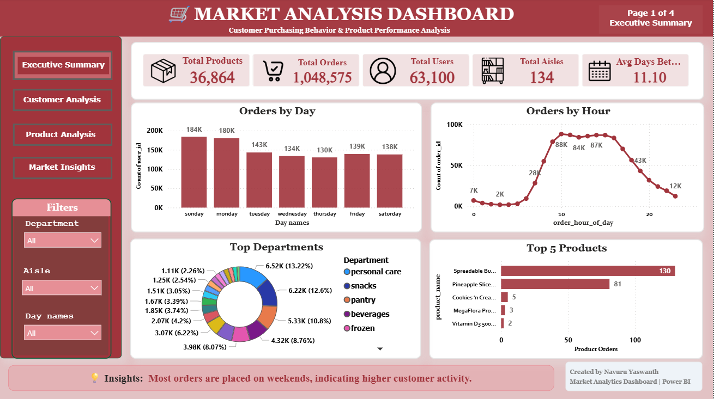
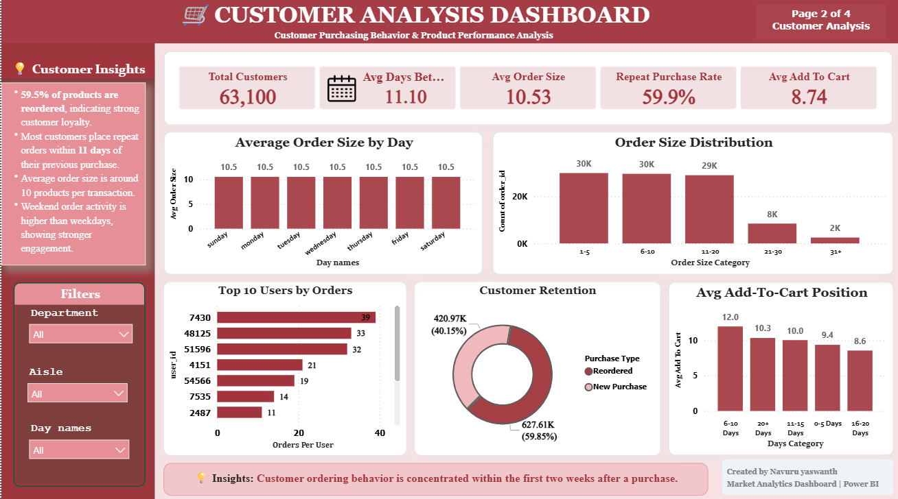
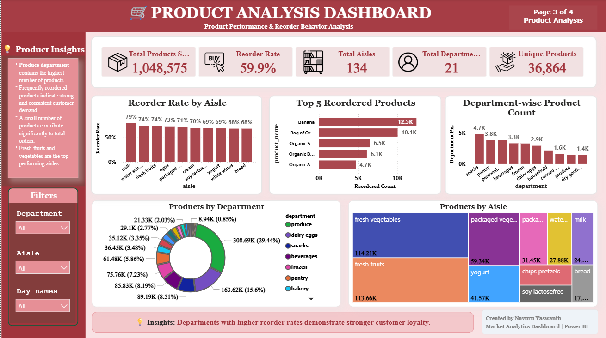
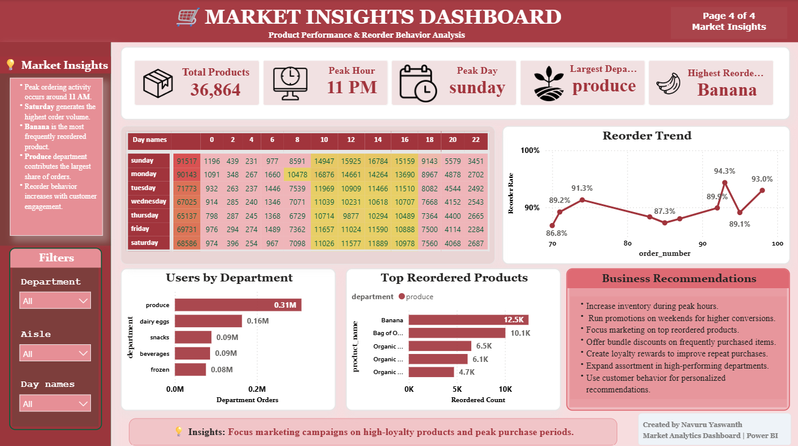

# 📊 Market Analysis Dashboard

## 📌 Project Overview

The **Market Analysis Dashboard** is a data analytics project developed using **SQL** and **Power BI** to analyze sales performance, customer behavior, product trends, and regional performance. The project transforms raw business data into interactive visualizations and actionable insights that support data-driven decision-making.

---

## 🎯 Objectives

* Analyze sales performance across different regions.
* Identify top-performing products and categories.
* Monitor customer purchasing behavior.
* Track revenue, profit, and order trends.
* Build an interactive dashboard for business reporting.

---

## 🛠️ Technologies Used

* **SQL** – Data querying, cleaning, and analysis
* **Power BI** – Interactive dashboard creation
* **Microsoft Excel** (if applicable) – Data preparation
* **DAX** – Measures and calculated columns in Power BI

---

## 📂 Project Structure

```
Market-Analysis-Project/
│
├── Market Analyst project.sql      # SQL queries and database script
├── Market Analyst project.pbix     # Power BI dashboard
├── README.md
└── screenshots/
    ├── dashboard.png
    ├── sales_analysis.png
    └── customer_analysis.png
```

---

## 📈 Dashboard Features

* Executive KPI Overview
* Total Sales
* Total Profit
* Total Orders
* Sales Trend Analysis
* Regional Sales Performance
* Product Category Analysis
* Customer Analysis
* Interactive Filters (Slicers)
* Dynamic Charts and Visualizations

---

## 📊 Key Insights

* Identified the best-performing products and categories.
* Compared sales performance across different regions.
* Analyzed customer purchasing patterns.
* Monitored monthly and yearly sales trends.
* Highlighted areas with high revenue and profit potential.

---

## 📷 Dashboard Preview

> Add screenshots of your Power BI dashboard inside the **screenshots** folder.

Example:





## 🚀 How to Run the Project

### SQL

1. Open SQL Server Management Studio (SSMS) or MySQL Workbench.
2. Import and execute **Market Analyst project.sql**.
3. Verify that the required tables and data are created successfully.

### Power BI

1. Open **Market Analyst project.pbix** in Power BI Desktop.
2. Refresh the dataset if required.
3. Explore the interactive dashboard using filters and slicers.

---

## 📌 Skills Demonstrated

* SQL Queries
* Data Cleaning
* Data Analysis
* Joins
* Aggregate Functions
* Group By
* Window Functions (if used)
* Power BI Dashboard Development
* Data Visualization
* DAX
* Business Intelligence
* KPI Reporting

---

## 📚 Learning Outcomes

This project strengthened my understanding of:

* SQL database querying
* Business data analysis
* Interactive dashboard development
* KPI reporting
* Data visualization best practices
* Converting raw data into actionable business insights

---

## 👤 Author

**Navuru Yaswanth**

Aspiring Data Analyst

* SQL
* Power BI
* Excel
* Data Visualization
* Business Intelligence
